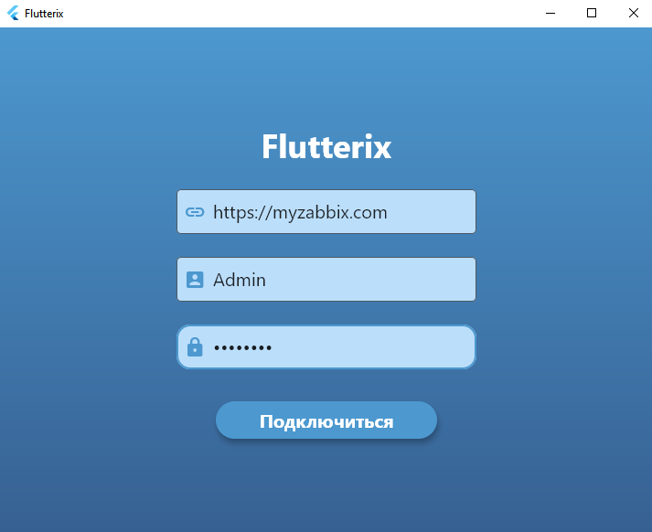

# zabbix_flutter_app

Cross-platform application for Zabbix monitoring system

## Getting Started

You need to build a project for the operating system you need.

To connect to Zabbix, you must have an active Zabbix server at least version 5.

